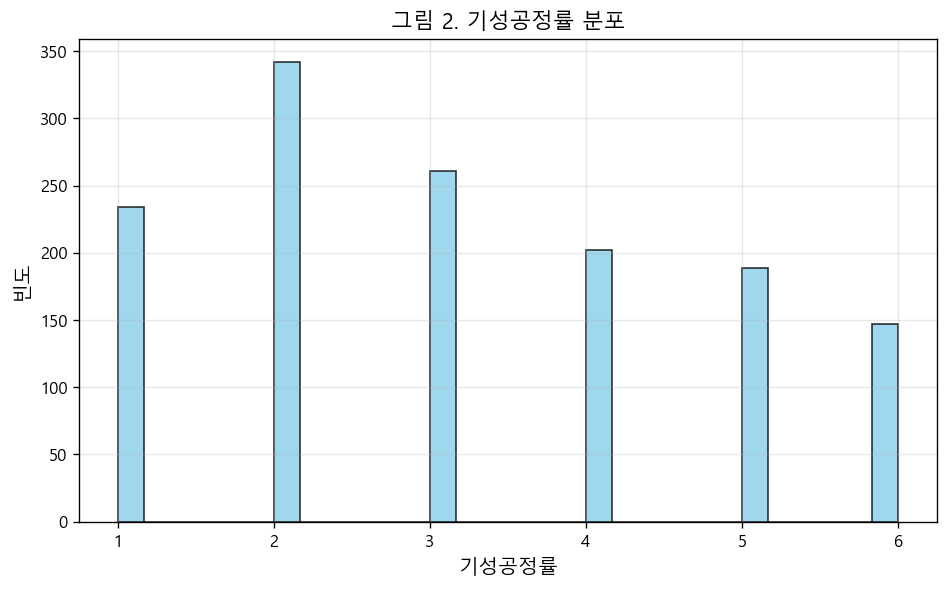

# 건설업 산업재해 예측 모형 — KEY PAPER 단순화 적용

> 의료 역학 분야 Q1 저널 논문(Qurat Ul Ain & Rather, 2025, *Annals of Epidemiology*)의 SHAP 통합 머신러닝 프레임워크를 한국 건설업 산업안전 데이터에 단순화 적용한 분석.

## 핵심 요약

1. **데이터**: 제10차 산업안전보건 실태조사(2021)의 건설업 1,375개 사업장
2. **방법**: 로지스틱 회귀(LR) 추론 + 머신러닝 4종(LR/RF/XGBoost/LightGBM) 예측 + SMOTENC(학습셋 한정)로 불균형 처리 + SHAP(XGBoost 기준) 해석
3. **핵심 발견**:
   - **정리정돈상태**가 사고를 줄이는 보호효과 (OR=0.84, p=0.035)
   - **고용노동부감독**만이, **A 그룹(내부 안전관리)에만**, 조절효과 작동 (p=0.018)

---

## 연구 질문 (RQ)

> 건설현장의 내부 안전 관리(A)와 실질적 안전 행동(B)이 산업재해 발생에 미치는 영향 — **외부 기관의 조절효과를 중심으로**

---

## 변수 구성

| 구분 | 변수 |
|---|---|
| 독립변수 A (내부관리) | 안전조직수준, 위원회수준, 인증보유 |
| 독립변수 B (현장행동) | 위험성평가수준, 교육훈련도움, 정리정돈상태, 작업중지권, 작업반장기여 |
| 조절변수 | 전문지도, 고용노동부감독, 안전보건공단지원 |
| 통제변수 | 공사규모, 발주처, 기성공정률, 공사종류, 외국인비율 |
| 종속변수 | 사고발생 (0=미발생, 1=발생) |

---

## KEY PAPER 매핑

| KEY PAPER (의료) | 본 연구 (건설안전) |
|---|---|
| 환자 1,200명 (합성) | 사업장 1,375개 (실제 공식조사) |
| 만성질환 유무 | 사고발생 유무 |
| BMI (modifiable risk factor) | 정리정돈상태 (modifiable risk factor) |
| 흡연 (조절변수 1개) | 전문지도·고용노동부감독·안전보건공단지원 (3개) |
| BMI×흡연 상호작용 1쌍 | A×조절 9쌍 + B×조절 15쌍 = 24쌍 |
| KNN imputation | Listwise deletion |
| RF + SVM + GBM | LR + RF + XGBoost + LightGBM (모델 교체, SMOTENC 추가) |
| SHAP TreeExplainer | SHAP TreeExplainer (동일) |

---

## 표 1. 변수 기술통계

| 변수명 | 평균±표준편차 | 최소값 | Q1 | 중앙값 | Q3 | 최대값 |
|---|---|---|---|---|---|---|
| 안전조직수준 | 0.98±0.15 | 0 | 1 | 1 | 1 | 1 |
| 위원회수준 | 0.73±0.44 | 0 | 0 | 1 | 1 | 1 |
| 위험성평가수준 | 1.78±0.59 | 0 | 2 | 2 | 2 | 2 |
| 교육훈련도움 | 4.31±0.74 | 1 | 4 | 4 | 5 | 5 |
| 정리정돈상태 | 4.22±0.76 | 1 | 4 | 4 | 5 | 5 |
| 작업중지권 | 4.35±0.75 | 1 | 4 | 4 | 5 | 5 |
| 작업반장기여 | 4.13±0.82 | 1 | 4 | 4 | 5 | 5 |
| 전문지도 | 0.36±0.48 | 0 | 0 | 0 | 1 | 1 |
| 고용노동부감독 | 0.51±0.50 | 0 | 0 | 1 | 1 | 1 |
| 안전보건공단지원 | 0.78±0.41 | 0 | 1 | 1 | 1 | 1 |
| 기성공정률 | 3.15±1.60 | 1 | 2 | 3 | 4 | 6 |
| 외국인비율 | 13.30±19.02 | 0 | 0 | 0 | 22 | 100 |

> **해석**: 분석에 사용한 12개 연속변수의 기본 분포입니다. 평균±표준편차는 "보통 어느 정도 값을 갖고 얼마나 흩어져 있는지"를 보여줍니다. 예를 들어 외국인비율은 평균 13.3%이지만 표준편차가 19%로 매우 크고, 중앙값이 0인 것은 외국인 근로자가 없는 사업장이 절반 이상이라는 뜻입니다.

---

## 표 2. 범주형 변수 및 사고발생 분포

| 변수명 | 범주 | 사례수(n) | 비율(%) |
|---|:---:|:---:|:---:|
| 인증보유 | 0 (미보유) | 937 | 68.1% |
| 인증보유 | 1 (보유) | 438 | 31.9% |
| 공사규모 | 1 (소) | 414 | 30.1% |
| 공사규모 | 2 (중) | 634 | 46.1% |
| 공사규모 | 3 (대) | 327 | 23.8% |
| 발주처 | 1 | 501 | 36.4% |
| 발주처 | 2 | 719 | 52.3% |
| 발주처 | 3 | 155 | 11.3% |
| 공사종류 | 1 (토목) | 424 | 30.8% |
| 공사종류 | 2 (토목) | 59 | 4.3% |
| 공사종류 | 3 (건축) | 287 | 20.9% |
| 공사종류 | 4 (건축) | 241 | 17.5% |
| 공사종류 | 5 (건축) | 124 | 9.0% |
| 공사종류 | 6 (플랜트) | 149 | 10.8% |
| 공사종류 | 7 (플랜트) | 91 | 6.6% |
| **사고발생** | **0 (미발생)** | **984** | **71.6%** |
| **사고발생** | **1 (발생)** | **391** | **28.4%** |

> **해석**: 전체 1,375개 사업장 중 사고 발생 391개(28.4%), 미발생 984개(71.6%)로 **불균형 구조**입니다. 모델이 "전부 사고 안 남"이라고만 예측해도 71.6% 정확도가 나옵니다. 그래서 정확도만 보면 안 되고, 정밀도·재현율·AUC 같은 지표를 같이 봐야 합니다.

---

## 그림 2. 기성공정률 분포



> **해석**: 1,375개 사업장의 기성공정률(공사 진척도)이 어떻게 퍼져 있는지 보여줍니다. 막대가 길수록 그 값을 가진 사업장이 많다는 뜻입니다. 분포가 한쪽으로 심하게 치우치지 않아 통계 분석에 적합합니다.

---

## 그림 3. 변수 상관관계 히트맵


> **해석**: 17개 변수가 서로 얼마나 함께 움직이는지를 색으로 표현했습니다. 빨간색은 양의 상관(같이 증가), 파란색은 음의 상관(하나 증가하면 하나 감소)입니다. 대부분 |상관계수| < 0.3으로 약한 관계만 보여, **다중공선성 문제(변수들이 너무 비슷해서 모델이 혼란스러워지는 것)가 거의 없습니다**.

---

## 표 4-A. A 그룹(내부 안전관리) 로지스틱 회귀

A 그룹(안전조직수준·위원회수준·인증보유) + 조절변수 + 통제변수의 사고발생 영향 분석.

| 변수명 | 계수 | 표준오차 | 오즈비(OR) | 95%CI 하한 | 95%CI 상한 | p값 | 유의도 |
|---|---:|---:|---:|---:|---:|---:|:---:|
| const | -1.0603 | 0.0673 | 0.3464 | 0.3036 | 0.3952 | 0.0000 | *** |
| 안전조직수준 | -0.0081 | 0.0756 | 0.9920 | 0.8553 | 1.1504 | 0.9150 |  |
| 위원회수준 | -0.0565 | 0.0693 | 0.9450 | 0.8251 | 1.0825 | 0.4145 |  |
| 인증보유 | -0.0733 | 0.0695 | 0.9293 | 0.8110 | 1.0649 | 0.2917 |  |
| 전문지도 | -0.0514 | 0.0650 | 0.9499 | 0.8362 | 1.0790 | 0.4289 |  |
| **고용노동부감독** | 0.1581 | 0.0700 | **1.1713** | 1.0211 | 1.3436 | **0.0240** | * |
| 안전보건공단지원 | 0.1154 | 0.0767 | 1.1223 | 0.9656 | 1.3045 | 0.1326 |  |
| **공사규모** | 0.3020 | 0.0754 | **1.3526** | 1.1669 | 1.5679 | **0.0001** | *** |
| 발주처 | 0.0851 | 0.0748 | 1.0888 | 0.9403 | 1.2608 | 0.2555 |  |
| **기성공정률** | 0.4813 | 0.0679 | **1.6182** | 1.4166 | 1.8485 | **0.0000** | *** |
| **공사종류** | -0.2737 | 0.0803 | **0.7605** | 0.6497 | 0.8902 | **0.0007** | *** |
| **외국인비율** | 0.2440 | 0.0630 | **1.2763** | 1.1282 | 1.4440 | **0.0001** | *** |

> **해석**:
> - **오즈비(OR)**가 1보다 크면 사고 위험을 높이고, 1보다 작으면 줄입니다.
> - **p값**이 0.05보다 작으면 "우연이 아니라 진짜 효과가 있다"고 판단합니다 (★ 표시).
> - **공사규모**(OR≈1.35, p<0.001), **기성공정률**(OR≈1.62, p<0.001), **외국인비율**(OR≈1.28, p<0.001)이 강하게 사고 위험을 높입니다.
> - **고용노동부감독**(OR≈1.17, p=0.024)이 양의 효과인데, 이는 "감독이 사고를 만든다"가 아니라 **이미 위험한 사업장에 감독이 가는 선택편향** 때문입니다.

---

## 표 4-B. B 그룹(현장 안전 행동) 로지스틱 회귀

B 그룹(위험성평가수준·교육훈련도움·정리정돈상태·작업중지권·작업반장기여) + 조절변수 + 통제변수의 사고발생 영향 분석.

| 변수명 | 계수 | 표준오차 | 오즈비(OR) | 95%CI 하한 | 95%CI 상한 | p값 | 유의도 |
|---|---:|---:|---:|---:|---:|---:|:---:|
| const | -1.0665 | 0.0676 | 0.3442 | 0.3015 | 0.3930 | 0.0000 | *** |
| 위험성평가수준 | 0.0333 | 0.0735 | 1.0339 | 0.8951 | 1.1942 | 0.6507 |  |
| 교육훈련도움 | -0.0189 | 0.0825 | 0.9813 | 0.8348 | 1.1535 | 0.8189 |  |
| **정리정돈상태** | -0.1726 | 0.0820 | **0.8415** | 0.7165 | 0.9882 | **0.0354** | * |
| 작업중지권 | 0.0444 | 0.0781 | 1.0454 | 0.8970 | 1.2183 | 0.5698 |  |
| 작업반장기여 | -0.0135 | 0.0820 | 0.9866 | 0.8402 | 1.1585 | 0.8692 |  |
| 전문지도 | -0.0435 | 0.0651 | 0.9574 | 0.8428 | 1.0877 | 0.5039 |  |
| **고용노동부감독** | 0.1481 | 0.0703 | **1.1597** | 1.0104 | 1.3310 | **0.0351** | * |
| 안전보건공단지원 | 0.1133 | 0.0767 | 1.1200 | 0.9637 | 1.3017 | 0.1396 |  |
| **공사규모** | 0.2594 | 0.0690 | **1.2962** | 1.1323 | 1.4838 | **0.0002** | *** |
| 발주처 | 0.0666 | 0.0754 | 1.0688 | 0.9220 | 1.2391 | 0.3775 |  |
| **기성공정률** | 0.4790 | 0.0681 | **1.6145** | 1.4128 | 1.8450 | **0.0000** | *** |
| **공사종류** | -0.2854 | 0.0805 | **0.7517** | 0.6420 | 0.8803 | **0.0004** | *** |
| **외국인비율** | 0.2214 | 0.0636 | **1.2478** | 1.1016 | 1.4134 | **0.0005** | *** |

> **해석**:
> - **정리정돈상태: OR=0.84, p=0.035** → "정리정돈이 잘 된 사업장일수록 사고 확률이 약 16% 낮아진다"는 뜻입니다.
> - OR이 1보다 작으니 사고를 **줄이는** 변수(보호효과)입니다.
> - 다른 B 변수들(교육훈련, 작업중지권 등)은 통계적으로 유의하지 않았습니다.
> - **왜 중요한가**: 정리정돈은 비용이 많이 드는 시설 투자가 아니라 **현장에서 즉시 개선 가능한 행동**입니다.

---

## 표 5-A. A 그룹 × 조절변수 상호작용 ★ RQ 핵심

외부기관 3종이 A 그룹 변수의 효과를 강화/약화시키는지 검정한 9쌍의 상호작용 결과.

| 조절변수 | 주효과변수 | 계수 | 오즈비(OR) | 95%신뢰구간 | p값 | 유의도 | 집합검정 p값 |
|---|---|---|---|---|---|---|---|
| 전문지도 | 안전조직수준 | -0.1381 | 0.871 | [0.736, 1.031] | 0.1093 | | 0.1929 |
| 전문지도 | 위원회수준 | -0.0296 | 0.9708 | [0.853, 1.104] | 0.6527 | | 0.1929 |
| 전문지도 | 인증보유 | 0.0835 | 1.0871 | [0.958, 1.233] | 0.1946 | | 0.1929 |
| **고용노동부감독** | 안전조직수준 | 0.1104 | 1.1167 | [0.936, 1.332] | 0.2191 | | **0.0178** |
| **고용노동부감독** | **위원회수준** | **-0.1428** | **0.8669** | **[0.757, 0.992]** | **0.0382** | **★** | **0.0178** |
| **고용노동부감독** | **인증보유** | **0.1526** | **1.1649** | **[1.023, 1.327]** | **0.0215** | **★** | **0.0178** |
| 안전보건공단지원 | 안전조직수준 | 0.0586 | 1.0604 | [0.935, 1.202] | 0.3609 | | 0.6652 |
| 안전보건공단지원 | 위원회수준 | 0.0484 | 1.0495 | [0.918, 1.200] | 0.4796 | | 0.6652 |
| 안전보건공단지원 | 인증보유 | -0.0387 | 0.9621 | [0.834, 1.110] | 0.5964 | | 0.6652 |

> **해석**:
> - **고용노동부감독만 유의한 조절효과**를 보였습니다 (집합검정 p=0.018).
> - 인증보유 × 감독: OR=1.165, p=0.022 ★
> - 위원회수준 × 감독: OR=0.867, p=0.038 ★
> - 전문지도와 안전보건공단지원은 어떤 A 변수와도 유의한 상호작용이 없었습니다.
> - **3개 외부기관 중 단 1개만 작동**한다는 깔끔한 패턴입니다.

---

## 표 5-B. B 그룹 × 조절변수 상호작용 (대조용)

B 그룹(현장 안전 행동) 변수와 외부기관 사이의 상호작용 15쌍 검정 결과 — **모두 무의 (유의도 0/15)**.

| 조절변수 | 주효과변수 | 오즈비(OR) | p값 | 집합검정 p값 |
|---|---|---:|---:|---:|
| 전문지도 | 위험성평가수준 | 0.8945 | 0.1127 | 0.1375 |
| 전문지도 | 교육훈련도움 | 1.0632 | 0.4766 | 0.1375 |
| 전문지도 | 정리정돈상태 | 1.1565 | 0.0788 | 0.1375 |
| 전문지도 | 작업중지권 | 1.0278 | 0.7248 | 0.1375 |
| 전문지도 | 작업반장기여 | 0.8669 | 0.0749 | 0.1375 |
| 고용노동부감독 | 위험성평가수준 | 0.9111 | 0.2173 | 0.4148 |
| 고용노동부감독 | 교육훈련도움 | 1.0427 | 0.6202 | 0.4148 |
| 고용노동부감독 | 정리정돈상태 | 1.1349 | 0.1324 | 0.4148 |
| 고용노동부감독 | 작업중지권 | 0.9819 | 0.8205 | 0.4148 |
| 고용노동부감독 | 작업반장기여 | 0.8972 | 0.1994 | 0.4148 |
| 안전보건공단지원 | 위험성평가수준 | 1.0898 | 0.1821 | 0.5743 |
| 안전보건공단지원 | 교육훈련도움 | 1.0204 | 0.8219 | 0.5743 |
| 안전보건공단지원 | 정리정돈상태 | 1.0860 | 0.3552 | 0.5743 |
| 안전보건공단지원 | 작업중지권 | 0.9640 | 0.6773 | 0.5743 |
| 안전보건공단지원 | 작업반장기여 | 1.0088 | 0.9299 | 0.5743 |

> **해석**: **B 그룹에는 어떤 외부기관 조절효과도 없었습니다** (15개 중 0개 유의). 감독이 제도적·구조적 차원(A)에서만 작동하고, 작업자 일상 행동(B)에는 영향을 미치지 못한다는 의미입니다.

---

## 조절효과 종합

| 조절변수 | A 그룹 유의 수 | B 그룹 유의 수 |
|---|---|---|
| 전문지도 | 0/3 | 0/5 |
| **고용노동부감독** | **2/3** | **0/5** |
| 안전보건공단지원 | 0/3 | 0/5 |

> **RQ에 대한 답**: 외부기관 3곳 중 **고용노동부감독만이**, 그것도 **내부 안전관리(A) 차원에 대해서만** 조절효과를 갖습니다. 현장 안전 행동(B)에는 어떤 외부기관도 조절효과를 보이지 않습니다.

---

## 표 9. 머신러닝 모델 비교

*SMOTENC는 학습셋에만 적용 (테스트셋은 원본 분포 유지, 데이터 누수 방지).*

| 모델명 | 정확도 | 정밀도 | 재현율 | F1점수 | AUC | 교차검증AUC |
|---|---|---|---|---|---|---|
| 로지스틱회귀 | 0.636 | 0.411 | 0.654 | 0.505 | 0.683 | 0.681±0.049 |
| 랜덤포레스트 | 0.684 | 0.456 | 0.603 | 0.519 | 0.697 | 0.711±0.045 |
| XGBoost | 0.680 | 0.450 | 0.577 | 0.506 | 0.710 | 0.686±0.040 |
| LightGBM | 0.687 | 0.459 | 0.577 | 0.511 | 0.706 | 0.697±0.042 |

> **해석**:
> - **정확도**: 전체 예측 중 맞힌 비율.
> - **정밀도**: "사고 난다"고 예측한 것 중 진짜 사고난 비율.
> - **재현율**: 실제 사고 중 맞춘 비율.
> - **AUC**: 0.5는 동전 던지기, 1.0이 완벽. 보통 0.7 이상이면 쓸 만합니다.
> - SMOTENC(학습셋 한정)로 클래스 불균형을 처리한 뒤 재현율이 크게 상승(LR 0.17→0.65)했고 정밀도는 소폭 하락했습니다. 트리 계열(RF·XGBoost·LightGBM) AUC가 LR보다 0.02~0.03 앞서지만 격차가 크지 않아, **데이터가 비교적 선형적 관계로 잘 설명된다**는 점은 여전합니다.

---

## 그림 4. ROC 곡선


> **해석**: 4개 모델이 사고 사업장과 정상 사업장을 얼마나 잘 구분하는지 보여줍니다. 곡선이 **왼쪽 위 모서리에 가까울수록** 좋고, 대각선(점선)은 무작위 예측입니다. 4개 모델 모두 AUC 0.68~0.71 수준으로 무작위보다 의미 있게 높습니다.

---

## SHAP 변수 중요도 (XGBoost 기준)


| 순위 | 변수명 | 평균 |SHAP| 값 |
|---|---|---|
| 1 | 기성공정률 | 0.900 |
| 2 | 공사종류 | 0.778 |
| 3 | 공사규모 | 0.473 |
| 4 | 외국인비율 | 0.443 |
| 5 | 발주처 | 0.341 |
| 6 | 교육훈련도움 | 0.339 |
| 7 | 고용노동부감독 | 0.256 |
| 8 | 정리정돈상태 | 0.251 |
| 9 | 작업중지권 | 0.230 |
| 10 | 작업반장기여 | 0.223 |

> **해석**: SHAP은 머신러닝 모델이 "왜 이렇게 예측했는지" 설명해주는 도구입니다. 각 변수가 예측에 기여한 정도를 수치화합니다.
> - **요약 그래프**: 점 하나가 사업장 1개. 색은 변수값(빨강=높음, 파랑=낮음), 가로 위치는 예측에 미친 영향(오른쪽=사고 위험 ↑).
> - **막대 그래프**: 변수별 평균 |SHAP| 값. 길수록 예측에 중요한 변수.
> - 통제변수와 외부기관이 상위를 차지하고, 독립변수의 SHAP 기여는 상대적으로 작습니다. 이는 **사고가 개별 행동보다 사업장 구조적 특성에 더 좌우된다**는 점을 시사합니다.
> - 참고: SHAP 절대값은 XGBoost의 log-odds 스케일 기반이라 RF 확률 스케일보다 약 10배 크게 표시됩니다. 상대 순위로 해석하세요.

---

## 종합 결론

| 발견 | 의미 |
|---|---|
| 정리정돈상태 보호효과 (OR=0.84, p=0.035) | 즉시 개선 가능한 행동 변수가 사고를 줄임 |
| 감독 × A 그룹 조절효과 (p=0.018) | 외부기관 중 감독만, 제도 차원에만 작동 |
| 통제변수가 SHAP 상위 독점 | 사업장 구조적 특성(기성공정률·공사종류·공사규모·외국인비율)이 사고에 가장 강한 영향 |
| SMOTENC 적용 후 트리 계열(XGB·LGBM·RF)이 LR보다 AUC 소폭 우위 | 비선형 상호작용 포착 이득이 존재하나 데이터 자체는 선형성이 강함 |
| SMOTENC 학습셋 한정 적용 | 테스트셋 분포 보존 → 재현율 급상승(LR 0.17→0.65)·정밀도 소폭 하락의 전형적 불균형 처리 효과 |

---

## 폴더 구조

```
construction_competition/
├── README.md (이 파일)
├── data/
│   ├── 전처리_최종.csv
│   └── 제10차 산업안전보건 실태조사_raw data_건설업_230824.CSV
├── notebooks/
│   ├── 01_전처리.ipynb (원자료 → 전처리_최종.csv)
│   └── 02_데이터분석.ipynb (표 1·2·4·5·9, 그림 2~6, SHAP)
├── results/
│   ├── tables/ (CSV 12개: 표 1~9, SHAP 중요도, 조절효과 종합)
│   └── figures/ (PNG 5개: 그림 2~6)
└── docs/
    ├── KEY_PAPER_매칭_해설.md
    ├── 데이터분석_과정_및_근거.md
    └── 전처리_근거_및_과정.md
```

## 참고 문헌

- Qurat Ul Ain, S., & Rather, K. U. I. (2025). Integrated statistical modeling and machine learning techniques with SHAP for epidemiological data analysis. *Annals of Epidemiology*, 108, 85-91.
- 한국산업안전보건공단 (2021). 제10차 산업안전보건 실태조사 (건설업).
- Reason, J. (1990, 2000). Swiss Cheese Model.
