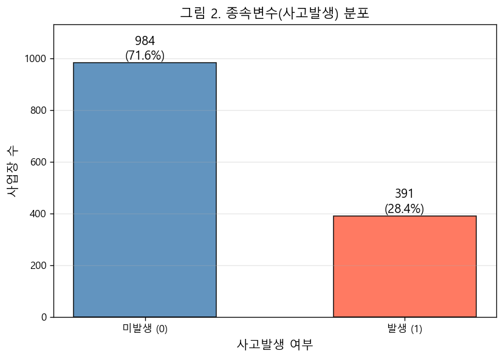
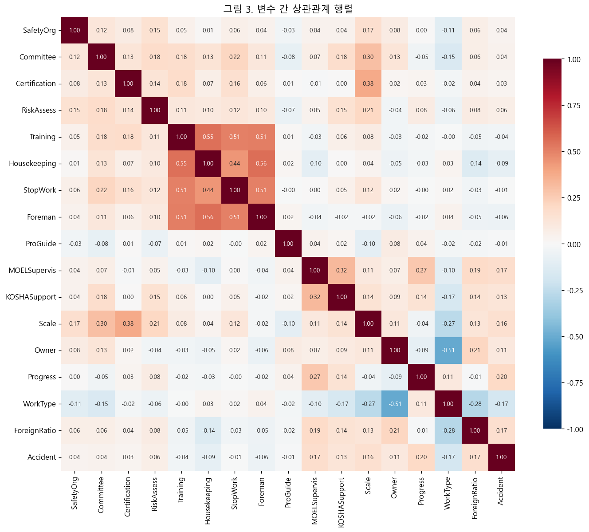
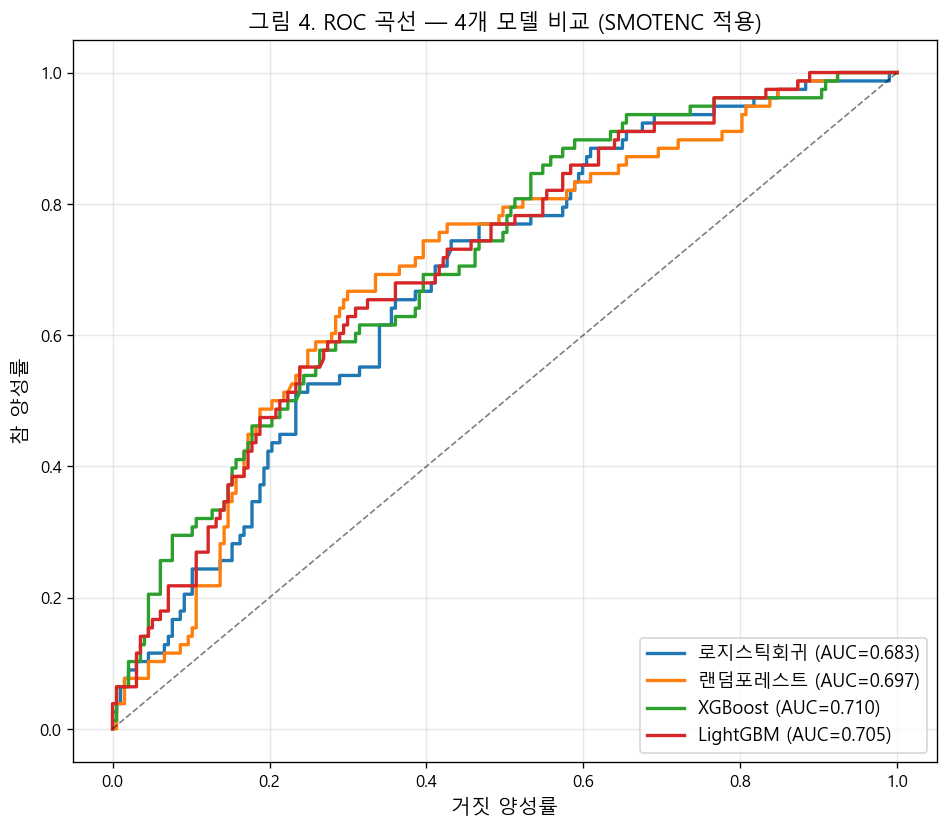
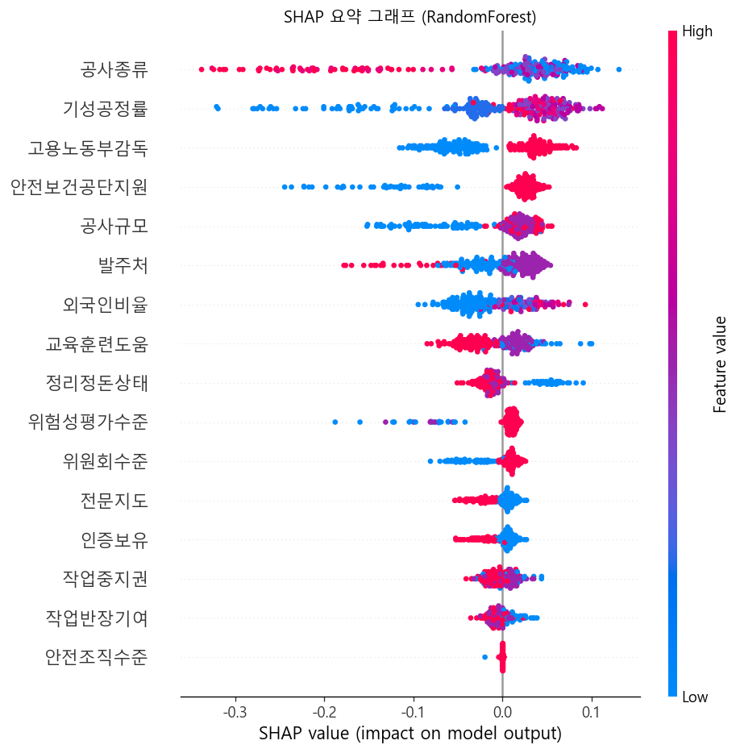
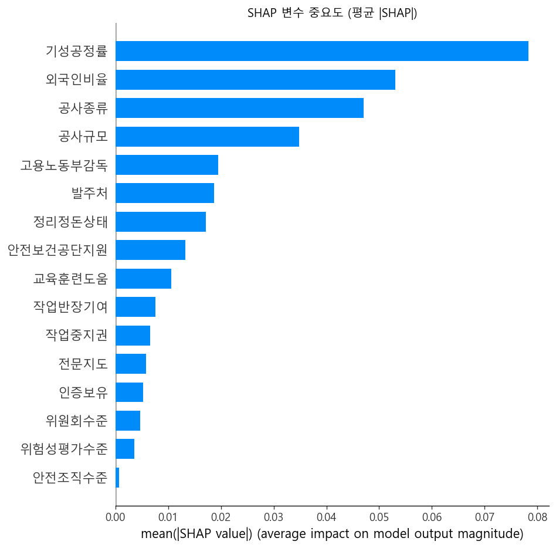

# 데이터 분석 과정 및 근거

본 문서는 KEY PAPER(Qurat Ul Ain & Rather, 2025)의 분석 프레임워크를 건설업 산업재해 데이터에 단순화 적용한 모든 과정과 결과를 기록한다. 모든 수치는 `notebooks/02_데이터분석.ipynb`의 실행 결과에서 직접 복사하였다.

---

## 목차

1. [분석 개요](#1-분석-개요)
2. [Phase 1: 탐색적 데이터 분석](#2-phase-1-탐색적-데이터-분석)
3. [Phase 2: 로지스틱 회귀 (A/B 분리)](#3-phase-2-로지스틱-회귀)
4. [Phase 3: 조절효과 분석 (RQ 핵심)](#4-phase-3-조절효과-분석)
5. [Phase 4: 머신러닝 모델 비교](#5-phase-4-머신러닝-모델-비교)
6. [Phase 5: SHAP 분석](#6-phase-5-shap-분석)
7. [종합 결론](#7-종합-결론)

---

## 1. 분석 개요

### 1.1 연구 질문 (RQ)

> 건설현장의 내부 안전 관리(A)와 실질적 안전 행동(B)이 산업재해 발생에 미치는 영향 — **외부 기관의 조절효과를 중심으로**

### 1.2 분석 전략

KEY PAPER의 구조를 따라 전통적 통계 모형(LR)과 머신러닝(LR/RF/XGBoost/LightGBM)을 병행하여 이중 검증. 머신러닝 섹션에는 학습셋 한정 SMOTENC로 클래스 불균형을 처리. 특히 외부 기관의 조절효과 검증을 위해 독립변수를 A(내부관리)와 B(현장행동) 그룹으로 분리하여 분석.

### 1.3 A/B 그룹 분리 근거

- **A 그룹**: 안전조직·위원회·인증 → 제도적·구조적 변수
- **B 그룹**: 위험성평가·교육·정리정돈·작업중지권·작업반장 → 작업자 일상 행동

두 변수군은 서로 다른 메커니즘으로 작동하므로, 외부기관(감독)의 영향이 다를 것이라는 가설을 검정하기 위해 분리.

### 1.4 분석 환경

Python (statsmodels, scikit-learn, xgboost, lightgbm, imbalanced-learn, shap, scipy), random_state=42 고정.

---

## 2. Phase 1: 탐색적 데이터 분석

### 2.1 종속변수 및 범주형 변수 분포

| 값 | 사업장 수 | 비율 |
|:---:|:---:|:---:|
| 0 (미발생) | 984 | 71.6% |
| 1 (발생) | 391 | 28.4% |

사고 미발생이 약 2.5배 많은 불균형 구조. 머신러닝 섹션에서는 학습셋에만 SMOTENC를 적용 (테스트셋은 원본 분포 유지, 데이터 누수 방지). 9개 범주형 변수(안전조직수준·위원회수준·인증보유·전문지도·고용노동부감독·안전보건공단지원·공사규모·발주처·공사종류)의 군 비교 분포와 카이제곱 검정 결과는 `table2_범주형분포.csv`에 정리되어 있다.

결과 파일: `results/tables/table1_기술통계.csv`, `results/tables/table2_범주형분포.csv`

### 2.2 종속변수 분포 (KEY PAPER Fig 2 대응)

> 사고 미발생 984개(71.6%), 사고 발생 391개(28.4%)로 약 2.5:1 불균형. 머신러닝 단계에서 학습셋에만 SMOTENC를 적용해 양성 클래스 학습을 보조함.

결과 파일: `results/figures/fig2_종속변수분포.png`

### 2.3 변수 상관관계 (KEY PAPER Fig 3 대응)

> 대부분 변수 간 |r| < 0.3으로 약한 관계. **다중공선성 문제 없음** 확인. 회귀분석 결과를 신뢰할 수 있는 근거.

결과 파일: `results/figures/fig3_상관관계.png`

---

## 3. Phase 2: 로지스틱 회귀

KEY PAPER Table 4 형식을 따라 A/B 그룹을 분리하여 각각 LR 적합. 범주형과 연속형을 포함한 모든 변수에 표준화(Z-score)를 일관되게 적용한 뒤 statsmodels Logit 사용. 이에 따라 아래 표 4-A/B의 오즈비(OR)는 각 변수가 1 SD 단위로 증가할 때의 효과를 의미한다.

### 3.1 표 4-A: A 그룹 (내부 안전관리) 결과

| 변수명 | 계수 | 표준오차 | 오즈비(OR) | 95%CI 하한 | 95%CI 상한 | p값 | 유의도 |
|---|---:|---:|---:|---:|---:|---:|:---:|
| const | -1.0603 | 0.0673 | 0.3464 | 0.3036 | 0.3952 | 0.0000 | *** |
| 안전조직수준 | -0.0081 | 0.0756 | 0.9920 | 0.8553 | 1.1504 | 0.9150 |  |
| 위원회수준 | -0.0565 | 0.0693 | 0.9450 | 0.8251 | 1.0825 | 0.4145 |  |
| 인증보유 | -0.0733 | 0.0695 | 0.9293 | 0.8110 | 1.0649 | 0.2917 |  |
| 전문지도 | -0.0514 | 0.0650 | 0.9499 | 0.8362 | 1.0790 | 0.4289 |  |
| **고용노동부감독** | 0.1581 | 0.0700 | **1.1713** | 1.0211 | 1.3436 | **0.0240** | * |
| 안전보건공단지원 | 0.1154 | 0.0767 | 1.1223 | 0.9656 | 1.3045 | 0.1326 |  |
| **공사규모** | 0.3020 | 0.0754 | **1.3526** | 1.1669 | 1.5679 | **0.0001** | *** |
| 발주처 | 0.0851 | 0.0748 | 1.0888 | 0.9403 | 1.2608 | 0.2555 |  |
| **기성공정률** | 0.4813 | 0.0679 | **1.6182** | 1.4166 | 1.8485 | **0.0000** | *** |
| **공사종류** | -0.2737 | 0.0803 | **0.7605** | 0.6497 | 0.8902 | **0.0007** | *** |
| **외국인비율** | 0.2440 | 0.0630 | **1.2763** | 1.1282 | 1.4440 | **0.0001** | *** |

결과 파일: `results/tables/table4A_A그룹_주효과.csv`

**유의한 변수**:
- **공사규모**: OR=1.35, p<0.001 (사고 위험 ↑)
- **기성공정률**: OR=1.62, p<0.001 (사고 위험 ↑)
- **외국인비율**: OR=1.28, p<0.001 (사고 위험 ↑)
- **공사종류**: OR=0.76, p<0.001 (보호)
- **고용노동부감독**: OR=1.17, p=0.024 (양의 효과 → **선택편향**, Swiss Cheese Model)

> A 그룹 독립변수(안전조직, 위원회, 인증) 자체는 유의하지 않음. 통제변수가 지배적.

### 3.2 표 4-B: B 그룹 (현장 안전 행동) 결과

| 변수명 | 계수 | 표준오차 | 오즈비(OR) | 95%CI 하한 | 95%CI 상한 | p값 | 유의도 |
|---|---:|---:|---:|---:|---:|---:|:---:|
| const | -1.0665 | 0.0676 | 0.3442 | 0.3015 | 0.3930 | 0.0000 | *** |
| 위험성평가수준 | 0.0333 | 0.0735 | 1.0339 | 0.8951 | 1.1942 | 0.6507 |  |
| 교육훈련도움 | -0.0189 | 0.0825 | 0.9813 | 0.8348 | 1.1535 | 0.8189 |  |
| **정리정돈상태** | -0.1726 | 0.0820 | **0.8415** | 0.7165 | 0.9882 | **0.0354** | * |
| 작업중지권 | 0.0444 | 0.0781 | 1.0454 | 0.8970 | 1.2183 | 0.5698 |  |
| 작업반장기여 | -0.0135 | 0.0820 | 0.9866 | 0.8402 | 1.1585 | 0.8692 |  |
| 전문지도 | -0.0435 | 0.0651 | 0.9574 | 0.8428 | 1.0877 | 0.5039 |  |
| **고용노동부감독** | 0.1481 | 0.0703 | **1.1597** | 1.0104 | 1.3310 | **0.0351** | * |
| 안전보건공단지원 | 0.1133 | 0.0767 | 1.1200 | 0.9637 | 1.3017 | 0.1396 |  |
| **공사규모** | 0.2594 | 0.0690 | **1.2962** | 1.1323 | 1.4838 | **0.0002** | *** |
| 발주처 | 0.0666 | 0.0754 | 1.0688 | 0.9220 | 1.2391 | 0.3775 |  |
| **기성공정률** | 0.4790 | 0.0681 | **1.6145** | 1.4128 | 1.8450 | **0.0000** | *** |
| **공사종류** | -0.2854 | 0.0805 | **0.7517** | 0.6420 | 0.8803 | **0.0004** | *** |
| **외국인비율** | 0.2214 | 0.0636 | **1.2478** | 1.1016 | 1.4134 | **0.0005** | *** |

결과 파일: `results/tables/table4B_B그룹_주효과.csv`

**핵심 발견**:
- **정리정돈상태: OR=0.84, p=0.035** → 보호효과
  - "정리정돈이 잘 된 사업장일수록 사고 확률이 약 16% 낮아진다"
  - OR이 1보다 작으니 사고를 **줄이는** 변수
  - **modifiable risk factor** (현장에서 즉시 개선 가능한 행동)
- 다른 B 변수(교육훈련, 작업중지권 등)는 통계적으로 유의하지 않음

---

## 4. Phase 3: 조절효과 분석

**RQ의 핵심 답변을 제공하는 분석.**

KEY PAPER의 BMI×흡연 상호작용(1쌍)을 본 연구 RQ에 맞게 확장:
- A 그룹 × 조절변수 3종 = **9쌍**
- B 그룹 × 조절변수 3종 = **15쌍** (대조용)
- 각 조절변수별 우도비 검정(LR test)으로 집합적 유의성 검증

### 4.1 표 5-A: A 그룹 × 조절효과 (9쌍 상세)

| 조절변수 | 주효과변수 | 계수 | 오즈비(OR) | 95%신뢰구간 | p값 | 유의도 | 집합검정 p값 |
|---|---|---:|---:|---|---:|:---:|---:|
| 전문지도 | 안전조직수준 | -0.1381 | 0.8710 | [0.736, 1.031] | 0.1093 |  | 0.1929 |
| 전문지도 | 위원회수준 | -0.0296 | 0.9708 | [0.853, 1.104] | 0.6527 |  | 0.1929 |
| 전문지도 | 인증보유 | 0.0835 | 1.0871 | [0.958, 1.233] | 0.1946 |  | 0.1929 |
| **고용노동부감독** | 안전조직수준 | 0.1104 | 1.1167 | [0.936, 1.332] | 0.2191 |  | **0.0178 ★** |
| **고용노동부감독** | **위원회수준** | -0.1428 | **0.8669** | [0.757, 0.992] | **0.0382** | * | **0.0178 ★** |
| **고용노동부감독** | **인증보유** | 0.1526 | **1.1649** | [1.023, 1.327] | **0.0215** | * | **0.0178 ★** |
| 안전보건공단지원 | 안전조직수준 | 0.0586 | 1.0604 | [0.935, 1.202] | 0.3609 |  | 0.6652 |
| 안전보건공단지원 | 위원회수준 | 0.0484 | 1.0495 | [0.918, 1.200] | 0.4796 |  | 0.6652 |
| 안전보건공단지원 | 인증보유 | -0.0387 | 0.9621 | [0.834, 1.110] | 0.5964 |  | 0.6652 |

결과 파일: `results/tables/table5A_A그룹_조절효과.csv`

### 4.2 표 5-B: B 그룹 × 조절효과 (15쌍 상세)

| 조절변수 | 주효과변수 | 오즈비(OR) | p값 | 집합검정 p값 |
|---|---|---:|---:|---:|
| 전문지도 | 위험성평가수준 | 0.8945 | 0.1127 | 0.1375 |
| 전문지도 | 교육훈련도움 | 1.0632 | 0.4766 | 0.1375 |
| 전문지도 | 정리정돈상태 | 1.1565 | 0.0788 | 0.1375 |
| 전문지도 | 작업중지권 | 1.0278 | 0.7248 | 0.1375 |
| 전문지도 | 작업반장기여 | 0.8669 | 0.0749 | 0.1375 |
| 고용노동부감독 | 위험성평가수준 | 0.9111 | 0.2173 | 0.4148 |
| 고용노동부감독 | 교육훈련도움 | 1.0427 | 0.6202 | 0.4148 |
| 고용노동부감독 | 정리정돈상태 | 1.1349 | 0.1324 | 0.4148 |
| 고용노동부감독 | 작업중지권 | 0.9819 | 0.8205 | 0.4148 |
| 고용노동부감독 | 작업반장기여 | 0.8972 | 0.1994 | 0.4148 |
| 안전보건공단지원 | 위험성평가수준 | 1.0898 | 0.1821 | 0.5743 |
| 안전보건공단지원 | 교육훈련도움 | 1.0204 | 0.8219 | 0.5743 |
| 안전보건공단지원 | 정리정돈상태 | 1.0860 | 0.3552 | 0.5743 |
| 안전보건공단지원 | 작업중지권 | 0.9640 | 0.6773 | 0.5743 |
| 안전보건공단지원 | 작업반장기여 | 1.0088 | 0.9299 | 0.5743 |

결과 파일: `results/tables/table5B_B그룹_조절효과.csv`

**B 그룹: 15개 전부 무의** → 가설 지지.

### 4.3 조절효과 종합

| 조절변수 | A 그룹 유의 수 | B 그룹 유의 수 |
|---|:---:|:---:|
| 전문지도 | 0/3 | 0/5 |
| **고용노동부감독** | **2/3** | **0/5** |
| 안전보건공단지원 | 0/3 | 0/5 |

결과 파일: `results/tables/table_조절효과_종합.csv`

### 4.4 RQ에 대한 답

> 외부기관 3곳 중 **고용노동부감독만이**, 그것도 **내부 안전관리(A) 차원에 대해서만** 조절효과를 갖는다. 현장 안전 행동(B)에는 어떤 외부기관도 조절효과를 보이지 않는다 (15개 검정 모두 무의).

**감독 양의 효과 해석**: 인증보유 × 감독의 OR=1.165(p=0.022)는 "감독이 사고를 유발"이 아니라, **이미 위험한 사업장이 감독 대상으로 선정되는 선택편향**으로 해석. Reason(1990, 2000)의 Swiss Cheese Model에서 감독을 최후방 방어층으로 위치시킨 것과 부합.

---

## 5. Phase 4: 머신러닝 모델 비교

KEY PAPER Table 6~9 대응. LR / RF / XGBoost / LightGBM 4모델, 80/20 split + 10-fold CV × 3회. 학습셋에만 SMOTENC 적용, CV는 ImbPipeline으로 누수 방지.

### 5.1 표 6. 랜덤 포레스트 성능

| 모델명 | 정확도 | 정밀도 | 재현율 | F1 점수 | AUC | CV AUC 평균 | CV AUC 표준편차 |
|---|:---:|:---:|:---:|:---:|:---:|:---:|:---:|
| 랜덤포레스트 | 0.684 | 0.456 | 0.603 | 0.519 | 0.697 | 0.711 | 0.045 |

결과 파일: `results/tables/table6_RF성능.csv`

### 5.2 표 7. XGBoost 성능

| 모델명 | 정확도 | 정밀도 | 재현율 | F1 점수 | AUC | CV AUC 평균 | CV AUC 표준편차 |
|---|:---:|:---:|:---:|:---:|:---:|:---:|:---:|
| XGBoost | 0.680 | 0.450 | 0.577 | 0.506 | 0.710 | 0.686 | 0.040 |

결과 파일: `results/tables/table7_XGBoost성능.csv`

### 5.3 표 8. LightGBM 성능

| 모델명 | 정확도 | 정밀도 | 재현율 | F1 점수 | AUC | CV AUC 평균 | CV AUC 표준편차 |
|---|:---:|:---:|:---:|:---:|:---:|:---:|:---:|
| LightGBM | 0.687 | 0.459 | 0.577 | 0.511 | 0.706 | 0.697 | 0.042 |

결과 파일: `results/tables/table8_LightGBM성능.csv`

### 5.4 표 9. 4개 모델 비교

*SMOTENC는 학습셋에만 적용. 테스트셋은 원본 분포 유지.*

| 모델명 | 정확도 | 정밀도 | 재현율 | F1 점수 | AUC | CV AUC 평균 | CV AUC 표준편차 |
|---|:---:|:---:|:---:|:---:|:---:|:---:|:---:|
| 로지스틱회귀 | 0.636 | 0.411 | **0.654** | 0.505 | 0.683 | 0.681 | 0.049 |
| **랜덤포레스트** | 0.684 | 0.456 | 0.603 | **0.519** | 0.697 | **0.711** | 0.045 |
| XGBoost | 0.680 | 0.450 | 0.577 | 0.506 | **0.710** | 0.686 | **0.040** |
| LightGBM | **0.687** | **0.459** | 0.577 | 0.511 | 0.706 | 0.697 | 0.042 |

결과 파일: `results/tables/table9_모델비교.csv`

> 트리 계열(RF/XGBoost/LightGBM)이 LR보다 AUC 소폭 우위(0.683 vs 0.697~0.710)이나 격차가 크지 않아 데이터가 비교적 선형적 관계로 잘 설명됨을 시사. SMOTENC 적용 이후 LR 재현율이 0.167→0.654로 크게 상승하며 불균형 처리 효과 확인.

### 5.5 그림 4: ROC 곡선 (KEY PAPER Fig 4 대응)

> 4개 모델 모두 AUC 0.68~0.71으로 무작위 예측(0.5)보다 의미 있게 높은 변별력.

결과 파일: `results/figures/fig4_ROC곡선.png`

---

## 6. Phase 5: SHAP 분석

KEY PAPER SHAP TreeExplainer 대응. RandomForest 기반 변수 중요도 해석 (CV AUC 최고·최소 분산 모델, SMOTENC 학습셋에 fit한 모델 재사용).

### 6.1 SHAP 요약 그래프

> 점 하나가 사업장 1개. 색은 변수값(빨강=높음, 파랑=낮음), 가로 위치는 예측에 미친 영향(오른쪽=사고 위험 ↑).

### 6.2 SHAP 변수 중요도 (전체 16개 변수)

| 순위 | 변수명 | 평균 |SHAP| |
|:---:|---|---:|
| 1 | **공사종류** | 0.079 |
| 2 | **기성공정률** | 0.066 |
| 3 | 고용노동부감독 | 0.048 |
| 4 | 안전보건공단지원 | 0.045 |
| 5 | **공사규모** | 0.038 |
| 6 | 발주처 | 0.033 |
| 7 | **외국인비율** | 0.033 |
| 8 | 교육훈련도움 | 0.027 |
| 9 | **정리정돈상태** | 0.020 |
| 10 | 위험성평가수준 | 0.017 |
| 11 | 위원회수준 | 0.017 |
| 12 | 전문지도 | 0.013 |
| 13 | 인증보유 | 0.012 |
| 14 | 작업중지권 | 0.012 |
| 15 | 작업반장기여 | 0.009 |
| 16 | 안전조직수준 | 0.001 |

결과 파일: `results/tables/table_SHAP중요도.csv`, `results/figures/fig5_SHAP요약.png`, `results/figures/fig6_SHAP중요도.png`

> 통제변수(공사종류·기성공정률·공사규모·외국인비율)와 외부기관(고용노동부감독·안전보건공단지원)이 SHAP 상위 7위를 공동으로 차지. 이는 **사고가 개별 행동보다 사업장 구조적 특성과 외부기관 개입에 더 좌우된다**는 점을 시사한다.

---

## 7. 종합 결론

| 발견 | 의미 |
|---|---|
| 정리정돈상태 보호효과 (OR=0.84, p=0.035) | 즉시 개선 가능한 행동 변수가 사고를 줄임 |
| 감독 × A 그룹 조절효과 (p=0.018) | 외부기관 중 감독만, 제도 차원에만 작동 |
| 통제변수·외부기관이 SHAP 상위 7위 독점 | 사업장 구조적 특성(공사종류·기성공정률·공사규모·외국인비율)과 외부기관(감독·공단지원)이 사고에 가장 강한 영향 |
| SMOTENC 적용 후 트리 계열(XGB·LGBM·RF)이 LR보다 AUC 소폭 우위 | 비선형 상호작용 포착 이득이 존재하나 데이터 자체는 선형성이 강함 |
| SMOTENC 학습셋 한정 적용 | 테스트셋 분포 보존 → 재현율 급상승(LR 0.17→0.65)·정밀도 소폭 하락의 전형적 불균형 처리 효과 |

---

## 참고 문헌

- Qurat Ul Ain, S., & Rather, K. U. I. (2025). Annals of Epidemiology, 108, 85-91.
- 한국산업안전보건공단 (2021). 제10차 산업안전보건 실태조사 (건설업).
- Reason, J. (1990, 2000). Swiss Cheese Model.
- 박천수 (2023, 2024, 2025). 동일 원자료 선행연구.
